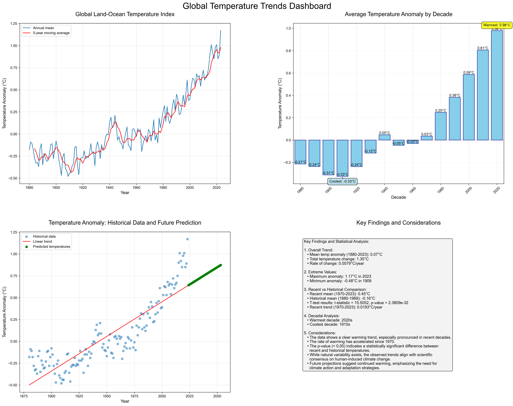

# Global Temperature Analysis Project

## Overview
This Python project analyzes global temperature trends using NASA's GISTEMP dataset. It generates a comprehensive dashboard visualizing temperature anomalies, decadal trends, and future projections.



## Features
1. Data retrieval and preprocessing
2. Time series visualization of global temperature anomalies
3. Decadal temperature trend analysis
4. Future temperature prediction using linear regression
5. Statistical analysis of temperature changes
6. Generation of a four-panel dashboard

## Technical Details

### Data Source
- NASA GISTEMP v4 dataset (GLB.Ts+dSST.csv)

### Libraries Used
- pandas: Data manipulation and analysis
- matplotlib: Data visualization
- numpy: Numerical computing
- scipy: Statistical functions
- sklearn: Machine learning (Linear Regression)

### Key Functions
1. `plot_global_temp()`: Plots annual mean and 5-year moving average of temperature anomalies
2. `analyze_by_decade()`: Creates a bar chart of average temperature anomalies by decade
3. `predict_future_temp()`: Predicts future temperatures using linear regression
4. `create_dashboard()`: Generates a 4-panel dashboard combining all visualizations and statistics

### Statistical Analyses
- Calculation of mean temperature anomalies
- Trend analysis (overall and recent periods)
- T-test comparing recent (1970-2023) vs historical (1880-1969) temperatures
- Identification of extreme values and warmest/coolest decades

## Output
- A PNG image file: 'global_temperature_trends_dashboard.png'
- Console output of summary statistics

## Usage
Run the script:
```
python global_temp_analysis.py
```

## Future Improvements
- Implement more advanced prediction models
- Add interactive features to the dashboard
- Incorporate additional climate datasets for comprehensive analysis
